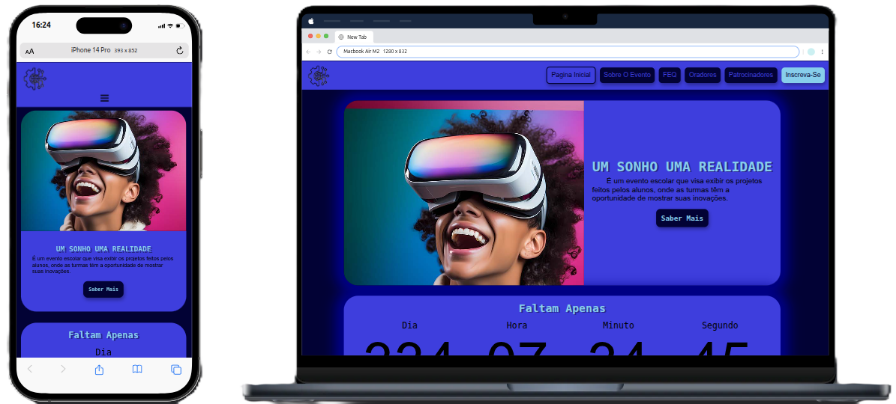

# 🌐 Um Sonho, Uma Realidade — Tech Event Website

Created by **WEB TECH**

**Um Sonho, Uma Realidade** is a website developed to promote a technology event, allowing visitors to:

- View details about the **speakers**;
- Discover the **sponsors** of the event;
- **Register** to attend.

This project aims to deliver a simple, responsive, and modern platform for promoting technology-related events.

## 🧩 Features

- Homepage with general event information;
- Speaker list with bios and details;
- Sponsor gallery with logos and links;
- Registration form with input validation;
- Fully responsive layout for mobile and desktop.

## 🛠️ Technologies Used

- HTML5 & CSS3  
- JavaScript

## 📷 Screenshot

## 🚀 How to Run the Project

1. acess this project:
   <a href="" >click on me</a>
   - **Acess now** [claudiobentodaladev.github.io/WEBTECH/](https://claudiobentodaladev.github.io/WEBTECH/)